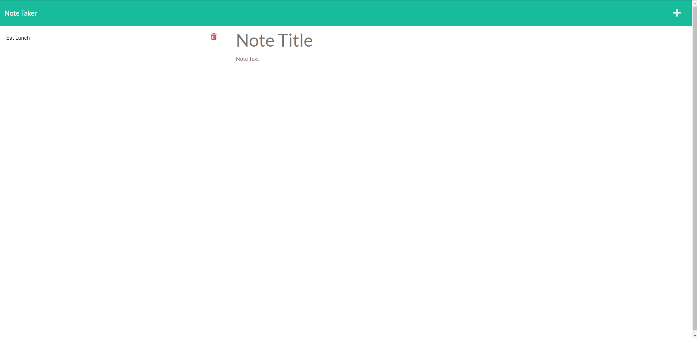

# Note Taker

## Description

This application is a simple note taker that uses an internal server to keep track of written notes. It contains functions to both write and delete notes, as well as viewing already written notes, the latter of which is kept read-only. This application provides a simple yet effective method of keeping track of a list of tasks that does not rely on local storage, thus reducing the amount of memory needed.

## Table of Contents

- [Installation](#installation)
- [Usage](#usage)
- [Credits](#credits)
- [License](#license)
- [Tests](#tests)

## Installation

Please take the following steps to install this application:

Install Node.js, Express.js

Please ensure that these steps are taken to ensure the application runs smoothly.

## Usage

There are no usage requirements for this application. Here is a link the the working application:

https://note-taker-31415.herokuapp.com/

Here is an image of the working application:

## Contributors

Here is a list of contributors to this application:

N/A

## License

N/A

## Tests

N/A

## Questions

Here are two links to reach out to me:

Github: https://github.com/Honsumal

Email: 14leealastair@gmail.com

